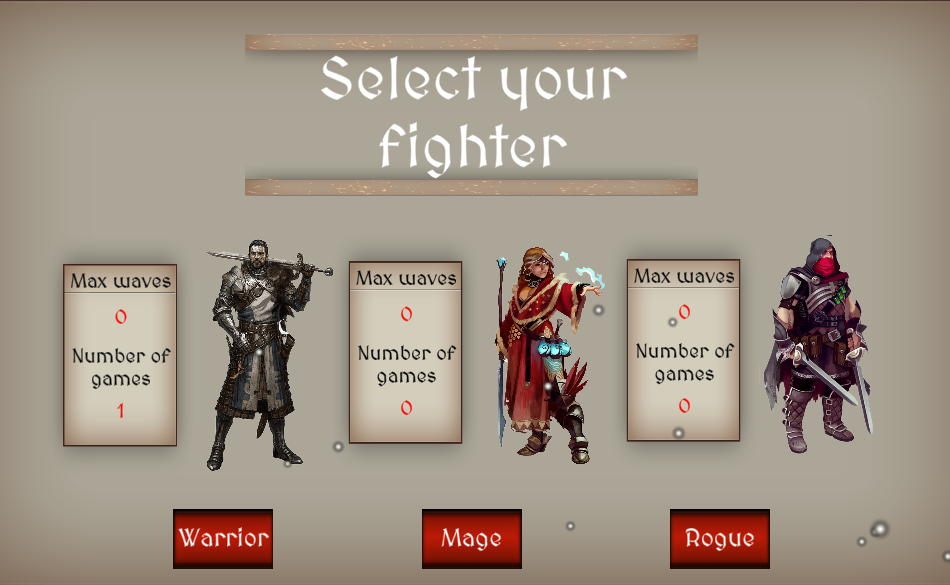
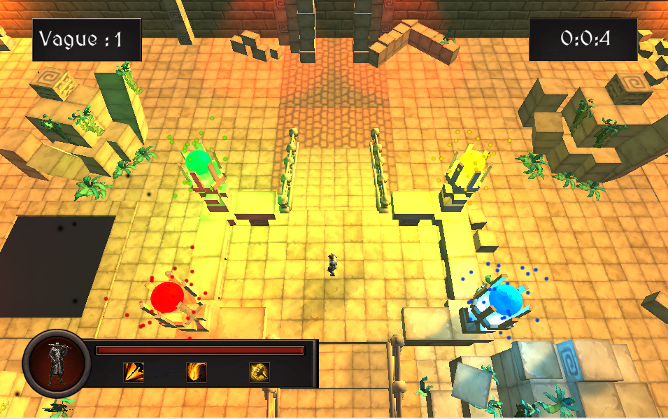

## Hero of the arena

Ce projet a été réalisé lors du cours d'introduction à Unity, dispensé lors de ma 2ème année à Télécom Sudparis.

L'objectif était de réaliser un jeu de type Hack & Slash, dans un temps relativement limité, du 11/2021 au 01/2022.

Il a été réalisé en collaboration avec deux autres étudiants.

Le jeu peut être joué sur itch.io [ici](https://manudiet.itch.io/hack-slash).

------

## Outils

Le jeu a été réalisé à l'aide du moteur de jeu Unity.
Divers assets externes ont été utilisés, dont la liste se trouve dans la section **Ressources**

Les musiques ont été composées par un des membres de l'équipe, Ludovic Blanc.

------

## Jeu

Le jeu est un jeu de type Hack & Slash. Le joueur se trouve dans une arène, dans laquelle vont apparaître plusieurs monstres, répartis entre différentes vagues. A la dernière vague, un boss apparaît. Si le joueur parvient à vaincre le boss, il remporte la victoire.

Le joueur peut jouer trois classes différentes :
- Le guerrier
- Le mage
- L'assassin
Chaque classe possède trois attaques distinctes, qui possèdent un temps de recharge plus ou moins long selon la puissance de l'attaque.

Le jeu possède 3 arènes distinctes. Au début de la partie, le joueur choisit son personnage, puis est placé dans une arène aléatoire. La partie ne s'arrête que si le joueur meurt ou bien s'il parvient à vaincre tous les ennemis.

------

## Ressources

- [Simple fantasy GUI](https://assetstore.unity.com/packages/2d/gui/simple-fantasy-gui-99451)
- [Free RPG Fantasy Spell Icons](https://assetstore.unity.com/packages/2d/gui/icons/free-rpg-fantasy-spell-icons-200511)
- [Dragon for Boss Monster](https://assetstore.unity.com/packages/3d/characters/creatures/dragon-for-boss-monster-hp-79398)
- [Necromancer](https://assetstore.unity.com/packages/3d/characters/necromancer-19340)
- [Medieval Cartoon Warriors](https://assetstore.unity.com/packages/3d/characters/medieval-cartoon-warriors-90079)
- [Earth Mage](https://assetstore.unity.com/packages/3d/characters/humanoids/fantasy/earth-mage-57637) :
- [Low Poly Skeleton](https://assetstore.unity.com/packages/3d/characters/creatures/low-pol-skeleton-188865)
- [Warrior Pack Bundle 3](https://assetstore.unity.com/packages/3d/animations/warrior-pack-bundle-3-free-47320)
- [Decrepit Dungeon LITE](https://assetstore.unity.com/packages/3d/environments/dungeons/decrepit-dungeon-lite-33936) 
- [Cartoon Temple Building Kit Lite](https://assetstore.unity.com/packages/3d/environments/dungeons/cartoon-temple-building-kit-lite-110397)
- [Cartoon Castle Building Kit](https://assetstore.unity.com/packages/3d/environments/dungeons/cartoon-castle-building-kit-128637)
- [GUI Parts](https://assetstore.unity.com/packages/2d/gui/icons/gui-parts-159068)
- [Level 1 Monster Pack](https://assetstore.unity.com/packages/3d/characters/creatures/level-1-monster-pack-77703)
- [Stylized RPG Starter Weapons](https://assetstore.unity.com/packages/3d/props/weapons/stylized-rpg-starter-weapons-184533)
